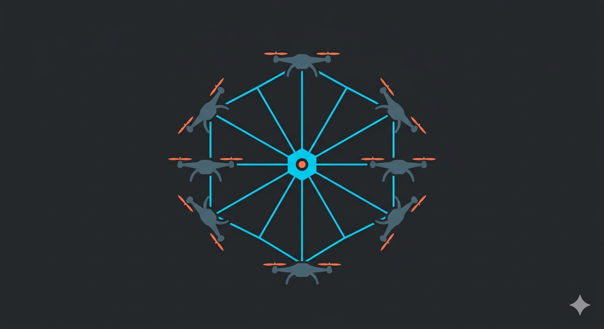

# offboard-control



High-level offboard control framework for **PX4**-based UAVs over **ROS 2**. It provides a clean Python API to control one or multiple drones simultaneously — arm, take off, navigate via waypoints, follow optimised trajectories, and run leader-follower formations — without writing any low-level FMU communication code.

---

## Features

- **Single-vehicle control** (`OffboardController`): arm/disarm, take-off, go-to GPS or local NED position, waypoint following, trajectory tracking with a velocity profile, dynamic target following, and return-to-launch.
- **Multi-vehicle control** (`MultiOffboardController`): all operations above applied in parallel to a fleet, with coordinated completion waiting.
- **Leader-follower formation**: the leader drone broadcasts its pose and velocity; followers apply a PD controller with NED offsets to maintain the formation.
- **Convex trajectory planning** (`formation_api`): optimal 3-D approach and loitering trajectories solved with CVXPY + CLARABEL.
- **Coordinate transforms**: GPS ↔ NED using GeographicLib.
- **Simulation and real-hardware support**: separate configuration services for Gazebo/SITL (`SimUAVSConfigurationService`) and real drones (`RealUAVSConfigurationService`).
- **Clean architecture**: decoupled domain with interfaces, in-memory state repositories, PX4 message mappers, and a swappable command dispatcher.

---

## Requirements

| Dependency | Minimum version |
|---|---|
| Ubuntu | 22.04 |
| ROS 2 | Humble |
| PX4 Autopilot | 1.14+ |
| px4_msgs | matching your PX4 version |
| Python | 3.10+ |

**Additional Python packages:**

```bash
pip install geographiclib scipy numpy cvxpy
```

**ROS 2 dependencies:**

```
rclpy
std_msgs
geometry_msgs
sensor_msgs
geographic_msgs
px4_msgs
```

---

## Installation

### 1. Clone into your ROS 2 workspace

```bash
cd ~/ros2_ws/src
git clone <repository-url> offboard-control
```

### 2. Install ROS 2 dependencies

```bash
cd ~/ros2_ws
rosdep install --from-paths src --ignore-src -r -y
```

### 3. Build the package

```bash
colcon build --packages-select offboard_control
source install/setup.bash
```

---

## Usage

### Single drone (simulation)

```python
import rclpy
from rclpy.node import Node
from rclpy.executors import MultiThreadedExecutor
from rclpy.callback_groups import ReentrantCallbackGroup

from offboard_control.service.sim_uavs_configuration_service import SimUAVSConfigurationService
from offboard_control.control.single_offboard_controller_assembler import SingleOffboardControllerAssembler

rclpy.init()
node = Node('my_offboard_node')

# Configure drone with id=1 in simulation (namespace /px4_1/...)
config_service = SimUAVSConfigurationService(node, vehicle_ids=[1])
configurations = config_service.get_offboard_configurations()

operation_group = ReentrantCallbackGroup()
assembler = SingleOffboardControllerAssembler()
controller = assembler.assemble(node, configurations[0], operation_group)

executor = MultiThreadedExecutor()
executor.add_node(node)

# Arm and take off to 10 m
future = controller.arm()
executor.spin_until_future_complete(future)

future = controller.take_off(height=10.0)
executor.spin_until_future_complete(future)

# Fly to a local NED position relative to the GPS origin
from geometry_msgs.msg import Pose
gps_origin = config_service.get_auto_gps_reference(vehicle_id=1)
target = Pose()
target.position.x = 20.0   # North (m)
target.position.y = 10.0   # East  (m)
target.position.z = -10.0  # Down in NED (altitude = -z)

future = controller.go_to_local(gps_origin, target)
executor.spin_until_future_complete(future)

# Land
future = controller.land()
executor.spin_until_future_complete(future)
```

### Multi-vehicle fleet (simulation)

```python
from offboard_control.service.sim_uavs_configuration_service import SimUAVSConfigurationService
from offboard_control.control.multi_offboard_controller_assembler import MultiOffboardControllerAssembler

config_service = SimUAVSConfigurationService(node, vehicle_ids=[1, 2, 3])
configurations = config_service.get_offboard_configurations()

assembler = MultiOffboardControllerAssembler()
fleet = assembler.assemble(node, configurations, num_threads=8)

# Arm entire fleet
future = fleet.arm_all()
executor.spin_until_future_complete(future)

# Take off all drones to 15 m
future = fleet.take_off_all(height=15.0)
executor.spin_until_future_complete(future)

# Send each drone to an individual GPS position
from geographic_msgs.msg import GeoPose
poses = [GeoPose(), GeoPose(), GeoPose()]
# ... fill latitude/longitude/altitude for each pose ...
future = fleet.go_to_all(poses)
executor.spin_until_future_complete(future)

# Land all
future = fleet.land_all()
executor.spin_until_future_complete(future)
```

### Leader-follower formation

```python
# Drone 0 is the leader; the rest maintain a 5 m separation
future = fleet.leader_follower(formation_dist=5.0, leader_id=0)
executor.spin_until_future_complete(future)
```

### Real hardware

Replace `SimUAVSConfigurationService` with `RealUAVSConfigurationService` using the same arguments. The ROS 2 topic namespaces follow the same pattern (`/px4_<id>/fmu/...`), so the application code is identical.

```python
from offboard_control.service.real_uavs_configuration_service import RealUAVSConfigurationService

config_service = RealUAVSConfigurationService(node, vehicle_ids=[1, 2])
```

---

## Project structure

```
offboard_control/
├── control/                    # Controller implementations
│   ├── offboard_controller.py             # Single-drone controller
│   ├── multi_offboard_controller.py       # Fleet controller
│   ├── single_offboard_controller_assembler.py
│   ├── multi_offboard_controller_assembler.py
│   ├── coordinate_transform_api.py        # GPS ↔ NED helpers
│   ├── formation_api.py                   # Optimal trajectory planner (CVXPY)
│   └── utils.py                           # Trajectory generator and formation offsets
├── dispatcher/                 # Command dispatch to the PX4 FMU
│   ├── px4_command_dispatcher.py
│   └── command_dispatcher_factory.py
├── domain/                     # Interfaces and domain models (clean architecture)
│   ├── control/
│   ├── dispatcher/
│   ├── mapper/
│   ├── model/
│   ├── repository/
│   ├── service/
│   └── state_listener/
├── repository/                 # In-memory state repositories
├── service/                    # Configuration services
│   ├── sim_uavs_configuration_service.py  # For simulation (SITL / Gazebo)
│   └── real_uavs_configuration_service.py # For real hardware
└── state_manager/              # ROS 2 state listeners
    └── state_listener/
        ├── event_source/       # ROS 2 subscribers
        └── mapper/             # PX4 message → internal model mappers
```

---

## API reference

### `OffboardController` (single drone)

| Method | Description |
|---|---|
| `arm()` | Arm the vehicle |
| `disarm()` | Disarm the vehicle |
| `take_off(height)` | Take off to the given height (m) |
| `land()` | Land the vehicle |
| `return_to_launch()` | Fly back to the launch point |
| `hold()` | Hold current position |
| `go_to(pose: GeoPose)` | Fly to GPS coordinates |
| `go_to_local(origin, pose)` | Fly to a local NED position |
| `local_waypoint_following(origin, waypoints)` | Follow a list of local NED waypoints |
| `trajectory_following(poses, velocities, yaw, dts)` | Follow a timed trajectory |
| `follow_target(origin, offset)` | Track a dynamic target with a PD controller and NED offset |
| `cancel_operation()` | Cancel the current operation |

All methods return an `rclpy.task.Future` that resolves to `{"success": bool, "msg": str}`.

### `MultiOffboardController` (fleet)

Every method above has an `_all()` variant (entire fleet) and an `ids`-indexed variant (subset). Additional methods:

| Method | Description |
|---|---|
| `leader_follower(formation_dist, leader_id)` | Leader-follower formation flight |
| `check_offboard(ids)` | Wait until the selected drones enter offboard mode |

---

## Tests

```bash
cd ~/ros2_ws
colcon test --packages-select offboard_control
colcon test-result --verbose
```

The test suite checks copyright headers, PEP 8 style (flake8), and docstring conventions (pep257).

---

## Author

**Manuel Domínguez Montero** — mandominguez97@gmail.com
